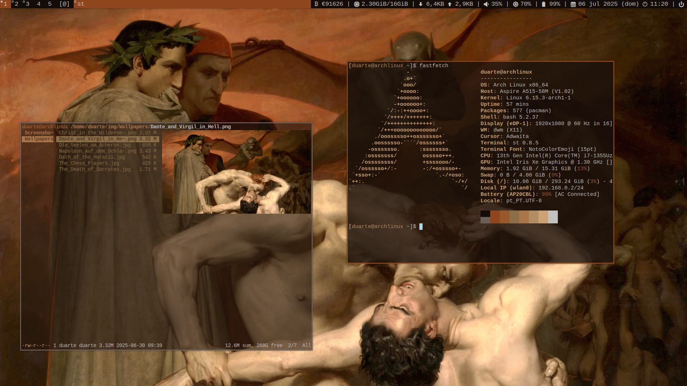
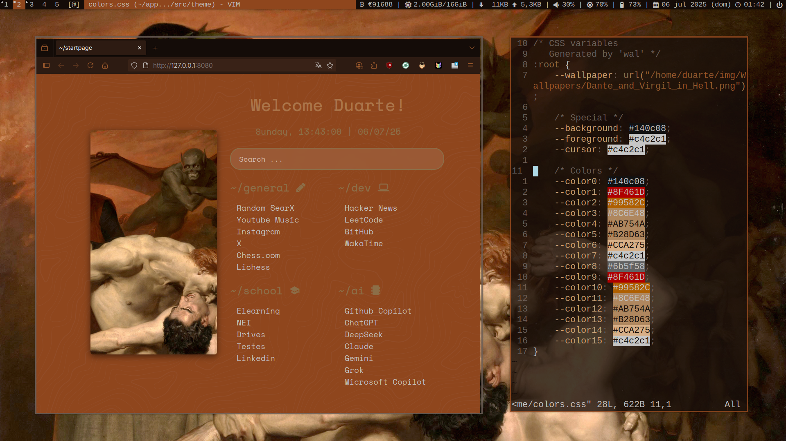

# duarte's dotfiles

These are my dotfiles for my dwm setup on arch.

Still is evolving, so, expect new changes.

## Dependencies

Everything was made to work with [pywal](https://github.com/eylles/pywal16).

## System

- **WM**: [my dwm build](https://github.com/duartebranco/dwm)
- **Terminal**: [my st build](https://github.com/duartebranco/st)
- **Launcher**: [my dmenu build](https://github.com/duartebranco/dmenu)
- **Bar**: [my dwmblocks build](https://github.com/duartebranco/dwmblocks)
- **Compositor**: picom
- **Notifications**: dunst
- **Shell**: bash

## Programs

- **Editor**: vim
- **GUI Editor**: Zed + [zed-theme wal (I've contributed to)](https://github.com/Fuwn/zed-theme-wal)
- **File Manager**: ranger
- **Document Viewer**: zathura
- **Color Temperature**: redshift

## Utilities

- **Startpage**: [my startpage](https://github.com/duartebranco/startpage)
